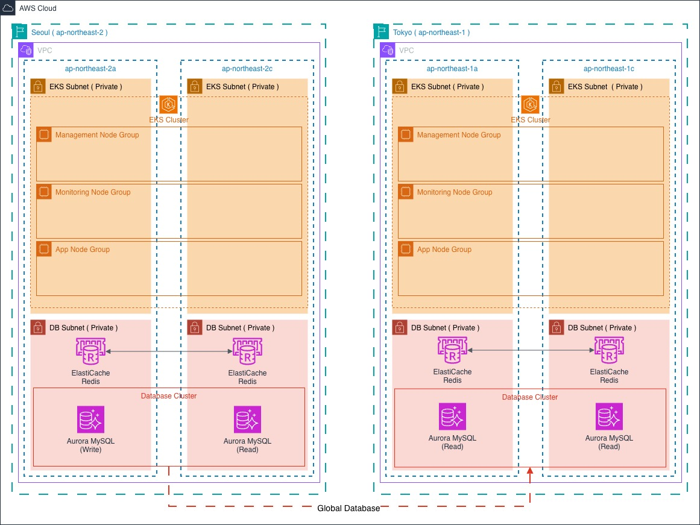

# 🚀 rocket-farm

> AWS EKS Multi-Region Infrastructure

## 📌 Overview

| 항목 | 내용                                                                                                                                                        |
| ---- | ----------------------------------------------------------------------------------------------------------------------------------------------------------- |
| 기간 | 2026.02 ~ 2026.04                                                                                                                                           |
| 인원 | 총 5명                                                                                                                                                      |
| 역할 | - EKS · DB 인프라 설계 · 구축<br>- Terraform 리소스 구성 · 변수 관리<br>- Karpenter · KEDA 오토스케일링 구성<br>- DR 아키텍처 설계 (Aurora Global Database) |
| 목적 | 단일 리전 구조의 장애 대응을 위한 멀티리전 DR 아키텍처 구축                                                                                                 |

## 🏗 Architecture



## 🛠 Tech Stack

| Category | Stack                                                 |
| -------- | ----------------------------------------------------- |
| Infra    | AWS EKS · VPC · Aurora MySQL · ElastiCache Redis      |
| IaC      | Terraform                                             |
| K8s      | Karpenter · KEDA                                      |
| DR       | Aurora Global Database · Warm Standby                 |

## 📁 Structure

```
rocket-farm/
├── README.md
├── docs/
│   └── images/
│       └── architecture.jpg
├── terraform/
│   ├── Modules/
│   │   ├── VPC/
│   │   ├── KMS/
│   │   ├── EKS/
│   │   └── DB/
│   │       ├── Aurora/
│   │       └── ElastiCache/
│   ├── Global/
│   ├── Seoul/
│   └── Tokyo/
└── yaml/
    ├── Karpenter/
    └── KEDA/
```

## 🔗 Portfolio

[\[Notion 포트폴리오 링크\]](https://www.notion.so/Rocket_farm-35835ef9a9be803095a3ef83916baa1f?source=copy_link)
